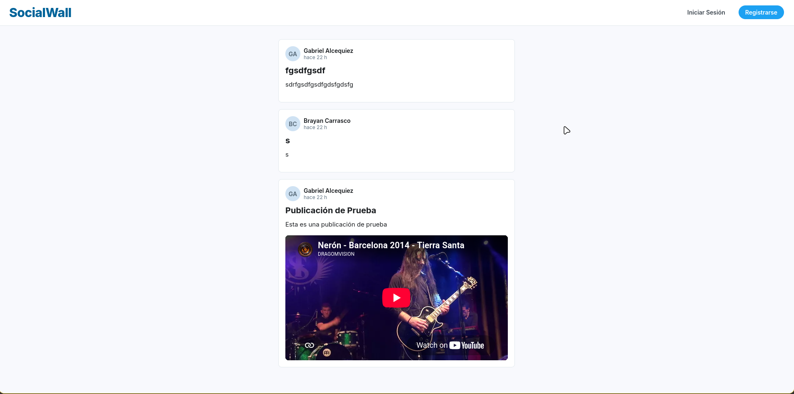
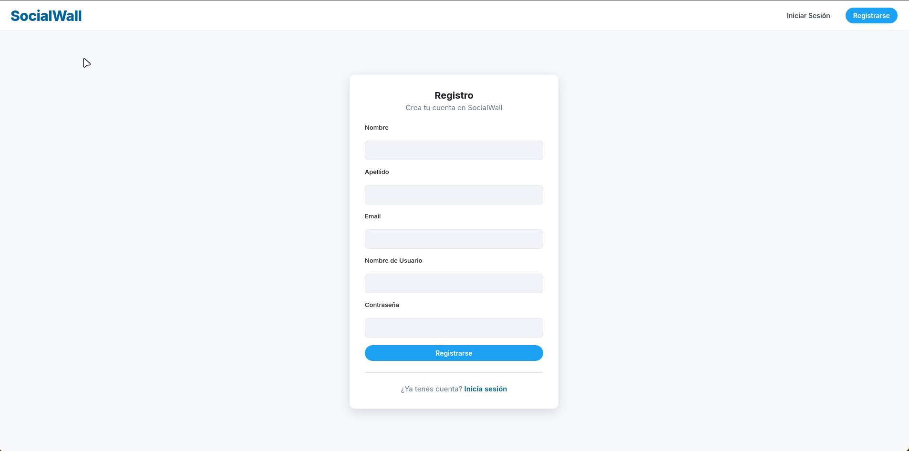
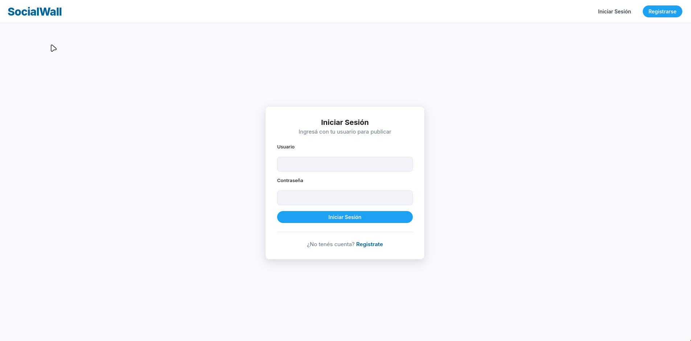
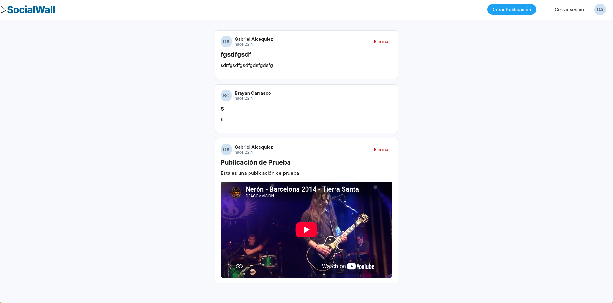
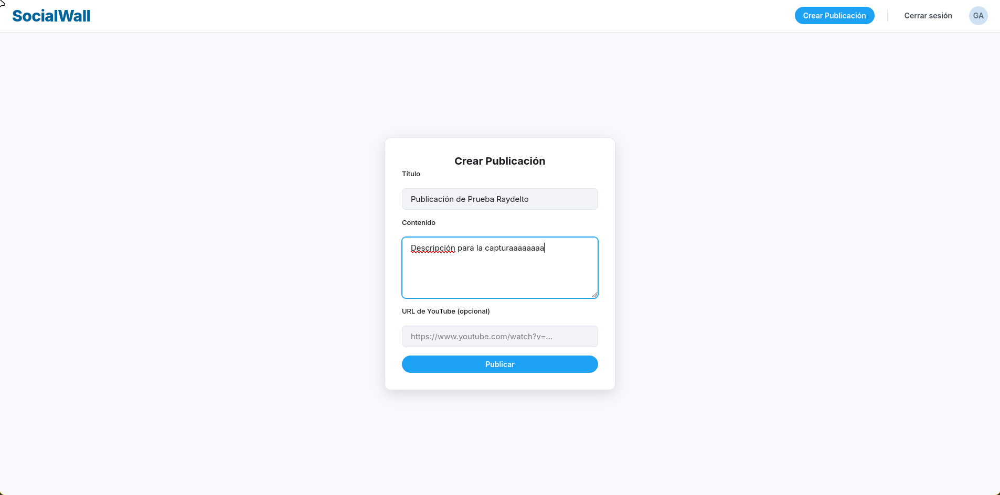

# Proyecto Final corresponiente a la materia de Programación Web

## Muro Interactivo (Gabriel Alcequiez, 2025-1062)

Se realizó utilizando Javascript, React y Firebase como backend (Firestore (base de datos) y Authentication (para la autenticación))

Sistema Web que permite a los visitantes ver todas las publicaciones realizadas por todos los usuarios, adicional a eso permite Crear una cuenta  y dicho esto, poder crear publicaciones (solo estando autenticando). El usuario en al publicación de forma opcional puede poner un link de un video de yt, para renderizarlo y mostrarlo.

También agregué para poder eliminar publicaciones (solo las del usuario autenticado en ese momento.)

### Home (no autenticado)

### Registro

### Login

### Home (autenticado)

### Crear publicación
